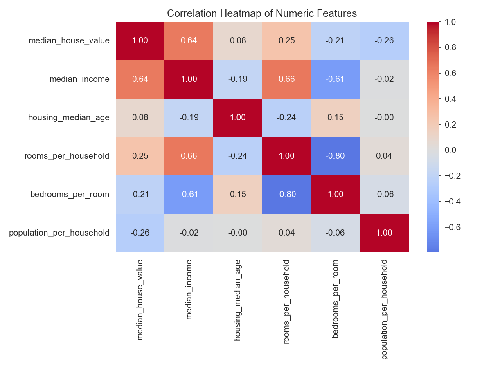
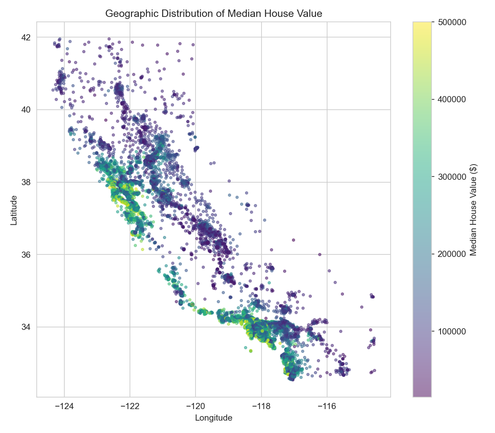
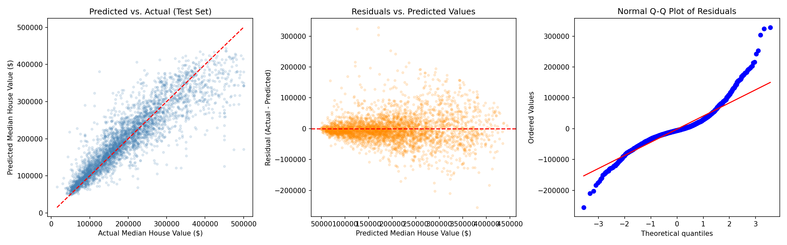

# California Housing Price Prediction

Predicting median house values for California census block groups using
statistical data cleaning, exploratory analysis, and machine learning.

A two-person team project for a graduate course in statistics and AI. The
pipeline cleans the 1990 U.S. Census California Housing data, explores it,
compares a linear regression baseline with a random forest regressor, and
selects the final model using cross-validation. A full technical report
explains the statistics behind the choice.

## Project Description

**Goal.** Build a model that predicts `median_house_value` (in USD) from
location, housing characteristics, and neighborhood income, and justify the
final model choice statistically.

**Approach.**
1. Clean the data: handle missing values, remove invalid records and outliers,
   and deal with the capped target variable.
2. Explore it: distributions, correlations, and geographic patterns.
3. Model it: compare a linear regression baseline against a random forest using
   5-fold cross-validation and a held-out test set.
4. Check the selected model: residual diagnostics, a normality test, and
   feature importances.

**Main result.** The random forest explains about 80% of the variance in house
values (test R² = 0.796) with a typical error of about $29,900 (MAE). It beats
the linear baseline by roughly $12,300 in cross-validated RMSE. Median income
and location are the strongest predictors.

## Results

| Model | CV RMSE (5-fold) | Test RMSE | Test MAE | Test R² |
|---|---|---|---|---|
| Linear regression (baseline) | $57,478 ± $1,081 | $58,464 | $43,137 | 0.652 |
| **Random forest (selected)** | **$45,204 ± $1,245** | **$44,715** | **$29,899** | **0.796** |

The random forest was selected because its cross-validated RMSE is lower by
about ten standard deviations of the fold-to-fold variation, and the
test-set results agree with the cross-validation.

**Top predictors (random forest importance):**

| Feature | Importance |
|---|---|
| `median_income` | 0.429 |
| `ocean_proximity_INLAND` | 0.181 |
| `population_per_household` | 0.111 |
| `longitude` | 0.077 |
| `latitude` | 0.069 |

**Residual diagnostics.** A Shapiro-Wilk test rejects normality of the residuals
(W = 0.908, p < 0.001). The residuals are right-skewed and mildly
heteroscedastic. This does not affect the random forest's predictions, but it
means prediction intervals based on a normal error assumption should not be
used.

### Selected figures





All figures are in `figures/`.

## Dataset

- **Source:** California Housing dataset (1990 U.S. Census block groups),
  20,640 records and 10 variables, from the public
  [ageron/handson-ml2](https://github.com/ageron/handson-ml2) repository.
- **Target:** `median_house_value` (USD).
- **Predictors:** longitude, latitude, housing median age, total rooms, total
  bedrooms, population, households, median income, and ocean proximity.

### Cleaning summary

| Step | Result |
|---|---|
| Raw data loaded | 20,640 rows, 10 columns |
| Missing `total_bedrooms` | 207 values, imputed by ocean-proximity group median |
| Top-coded target (≥ $500,001) | 965 rows removed |
| IQR outliers | 1,100 rows removed |
| **Final cleaned data** | **18,575 rows, 13 columns** |

Three ratio features are added: `rooms_per_household`, `bedrooms_per_room`, and
`population_per_household`.

## Project Structure

```
.
├── data/
│   ├── housing.csv            # Raw source data (20,640 records)
│   └── housing_clean.csv      # Cleaned, feature-engineered data
├── src/
│   ├── data_prep.py           # Cleaning and feature engineering pipeline
│   ├── eda.py                 # Exploratory data analysis and figures
│   └── model.py               # Model training, CV, evaluation, selection
├── figures/                   # Saved EDA and diagnostic plots
├── models/
│   └── final_model.joblib     # Serialized final model
├── reports/
│   ├── Technical_Report.pdf   # Final technical report
│   ├── model_metrics.json     # Cross-validation and test metrics
│   └── feature_importance.csv # Random forest feature importances
├── requirements.txt
└── README.md
```

## Getting Started

**Requirements:** Python 3.9 or newer.

```bash
git clone https://github.com/lubin2011/california-housing-project.git
cd california-housing-project

python3 -m venv venv
source venv/bin/activate          # Windows: venv\Scripts\activate
pip install -r requirements.txt
```

## Running the Pipeline

Run each script **from the project root folder** (the folder that contains
`data/` and `src/`), in this order:

```bash
python3 src/data_prep.py   # -> data/housing_clean.csv
python3 src/eda.py         # -> figures/*.png
python3 src/model.py       # -> models/final_model.joblib, reports/model_metrics.json
```

`model.py` takes about one to two minutes. It may print harmless `RuntimeWarning`
messages from the linear regression step on some Macs.

**Using a Jupyter notebook?** Set the working folder first, then use `%run`:

```python
import os
os.chdir("/path/to/california-housing-project")
```
```python
%run src/data_prep.py
```

**Using the saved model:**

```python
import joblib
import pandas as pd

model = joblib.load("models/final_model.joblib")
clean = pd.read_csv("data/housing_clean.csv")
predictions = model.predict(clean.drop(columns=["median_house_value"]).head())
print(predictions)
```

## Methodology

1. **Cleaning.** Remove non-physical records, drop rows at the $500,001 cap,
   impute missing bedrooms, engineer ratio features, and remove outliers with
   the 1.5 × IQR rule on the ratio features.
2. **Exploratory analysis.** Distribution of the target, correlation heatmap,
   income versus value, geographic scatter, and value by ocean proximity.
3. **Modeling.** An 80/20 train/test split (`random_state=42`). A scikit-learn
   pipeline with median imputation and standardization for numeric features and
   one-hot encoding for `ocean_proximity`.
   - Baseline: `LinearRegression`.
   - Candidate: `RandomForestRegressor` (150 trees, `max_depth=18`,
     `min_samples_leaf=3`).
4. **Model selection.** 5-fold cross-validated RMSE on the training set picks the
   model, and the held-out test set gives an unbiased final estimate.
5. **Diagnostics.** Residual plots, a Shapiro-Wilk normality test, and feature
   importances.

The full statistical discussion is in `reports/Technical_Report.pdf`.

## Limitations

- **Old data.** The data is from the 1990 census. Prices and neighborhoods have
  changed a great deal, so the model should not be used to price current homes.
- **Reduced scope.** Removing the 965 top-coded rows means the model applies to
  block groups with median values below $500,000 and is not reliable above that.
- **Unit of analysis.** Each row is a census block group, not an individual
  house, so predictions describe neighborhoods.
- **Non-normal residuals.** Errors are right-skewed, so normal-theory prediction
  intervals are not valid.
- **No tuning search.** The random forest hyperparameters were chosen by hand,
  and a systematic search might improve performance slightly.

## Code Style

All Python code follows [PEP 8](https://peps.python.org/pep-0008/). Check it
with:

```bash
pycodestyle --max-line-length=99 src/*.py
```

## Team

| Name | Contribution |
|---|---|
| *(Francois Lubin)* | *(data cleaning, analysis, modeling)* |
| *(Angelica Johnson)* | *(e.g. EDA, technical report)* |

## References

- Pace, R. K., & Barry, R. (1997). Sparse spatial autoregressions. *Statistics &
  Probability Letters, 33*(3), 291-297.
- Géron, A. (2019). *Hands-on machine learning with Scikit-Learn, Keras, and
  TensorFlow* (2nd ed.). O'Reilly Media.
- Pedregosa, F., et al. (2011). Scikit-learn: Machine learning in Python.
  *Journal of Machine Learning Research, 12*, 2825-2830.

## License

For academic and coursework use.
